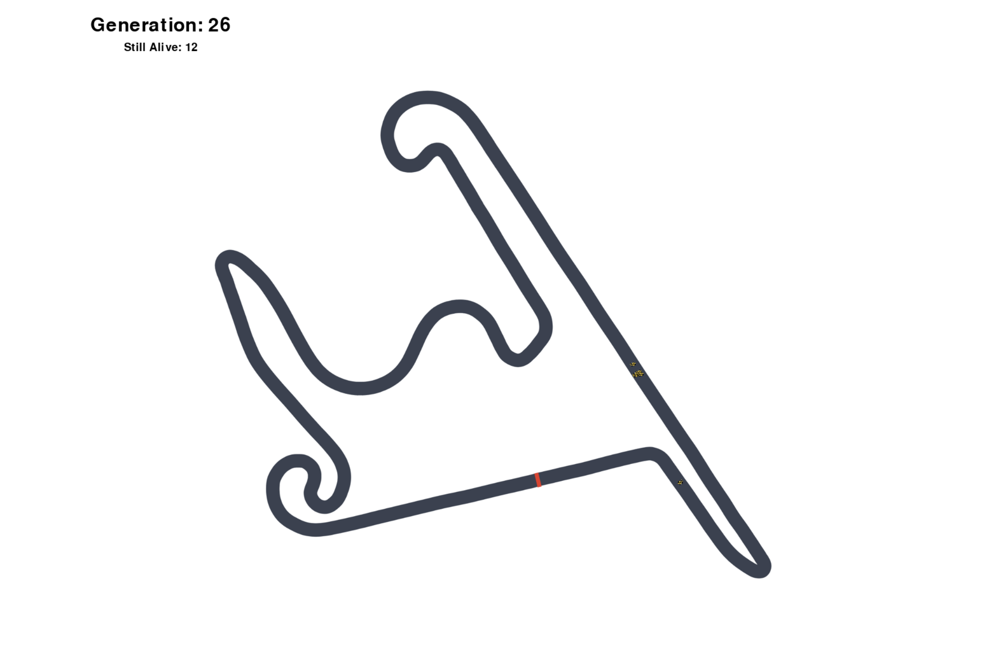

# Self-Driving Cars in F1 Tracks

A self-driving AI car simulation using NeuroEvolution of Augmenting Topologies (NEAT) algorithm. 



## Installation 

Use the package manager [pip3](https://pip.pypa.io/en/stable/) to install neat-python and pygame. 

```bash
pip3 install neat-python
pip3 install pygame
```

## Usage

An example usage is:

```bash
pyton3 play.py silverstone
```

There are 8 F1 tracks:

1. Bahrain
2. Interlagos
3. Shanghai
4. Monza
5. Zandvoort
6. Spa
7. COTA
8. Silverstone

The tracks have been modified from the svgs from https://f1laps.gumroad.com/l/f1-track-vectors, and the project has been inspired by https://youtu.be/2o-jMhXmmxA?si=XuOJL1j5XHNsid49.

