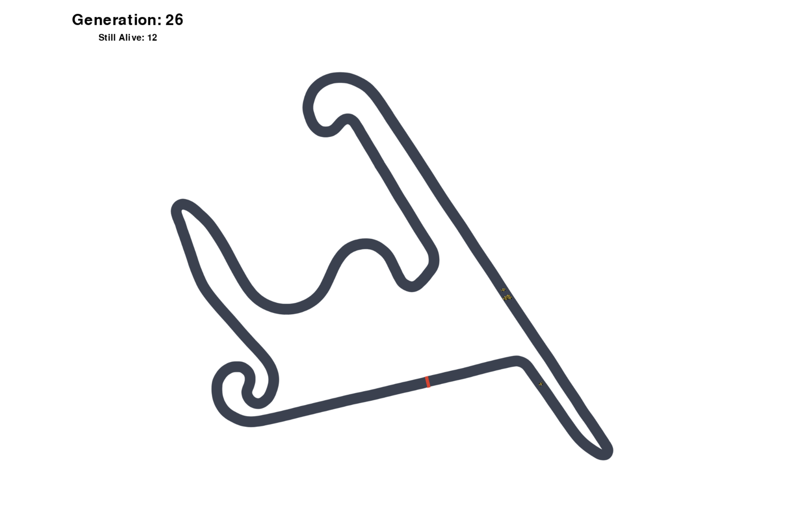

# Self-Driving Cars Around F1 Tracks Using AI

A self-driving AI car simulation using NeuroEvolution of Augmenting Topologies (NEAT) algorithm. 



## Installation 

Use the package manager [pip3](https://pip.pypa.io/en/stable/) to install neat-python and pygame. 

```bash
pip3 install neat-python
pip3 install pygame
```

## Usage

Train drivers on a track (opens a fullscreen window):

```bash
python3 play.py silverstone
```

### Faster training & watching the result

The simulation now saves the best evolved driver and lets you replay it:

```bash
python3 play.py silverstone --fast              # headless, no window — trains many generations per second
python3 play.py silverstone --generations 200   # cap how long training runs
python3 play.py silverstone --replay            # load champions/silverstone.pkl and watch it drive
```

Training periodically writes NEAT checkpoints and, when it finishes, pickles the
best genome to `champions/<track>.pkl`.

### Lap-aware reward (checkpoint gates)

By default fitness rewards distance driven. For real racing behaviour you can
place ordered **checkpoint gates** around a track; the car is then rewarded for
passing them in sequence and completing laps. Author them interactively:

```bash
python3 play.py silverstone --edit-checkpoints
```

In the editor: **click** to drop a gate, **`[` / `]`** to shrink/grow its
radius, **`u`** to undo, **`s`** to save to `checkpoints/<track>.json`, **esc**
to quit. If a gate file exists it is used automatically during training and
replay; otherwise training falls back to the distance reward.

### Sensors

Each car sees **7 radar beams** (−90° to +90°) plus its own normalized speed —
8 network inputs in total. The four outputs are steer-left, steer-right, brake,
and accelerate. `num_inputs` in `config.txt` must match (a startup check
enforces this).

You can change the configurations in config.txt to see if you can create better models!

There are 8 F1 tracks:

1. Bahrain
2. Interlagos
3. Shanghai
4. Monza
5. Zandvoort
6. Spa
7. COTA
8. Silverstone

The tracks have been modified from the svgs from https://f1laps.gumroad.com/l/f1-track-vectors, and the project has been inspired by https://youtu.be/2o-jMhXmmxA?si=XuOJL1j5XHNsid49.

