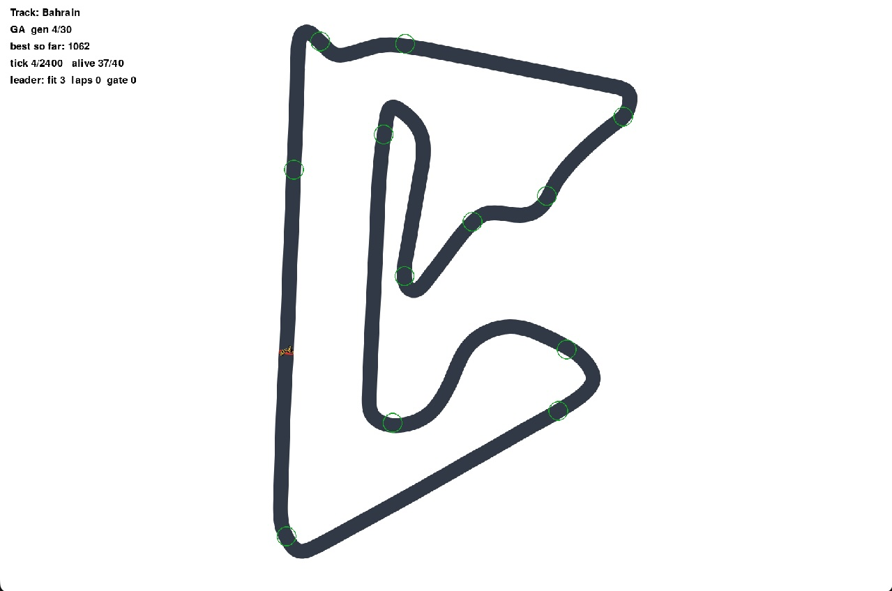
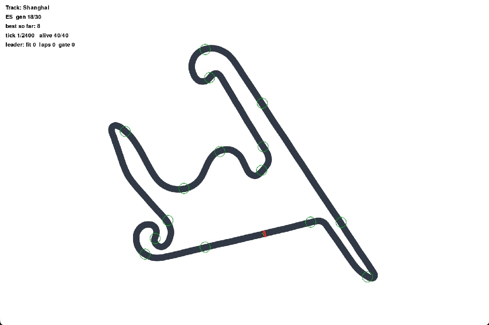
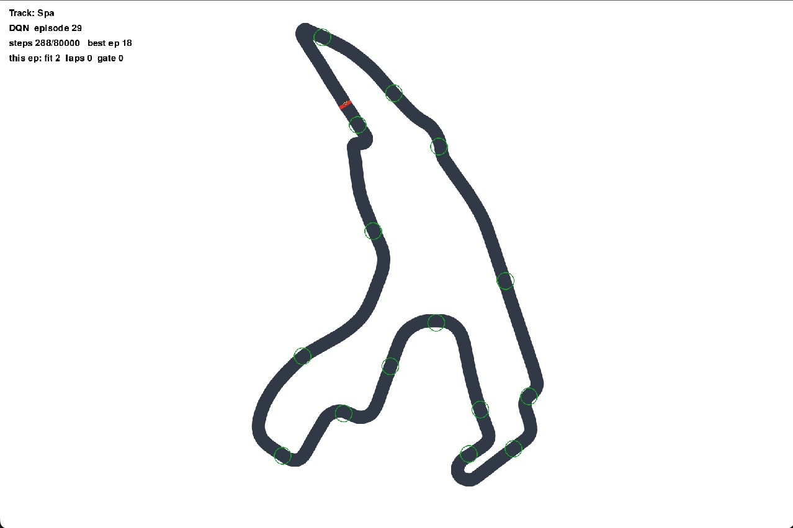
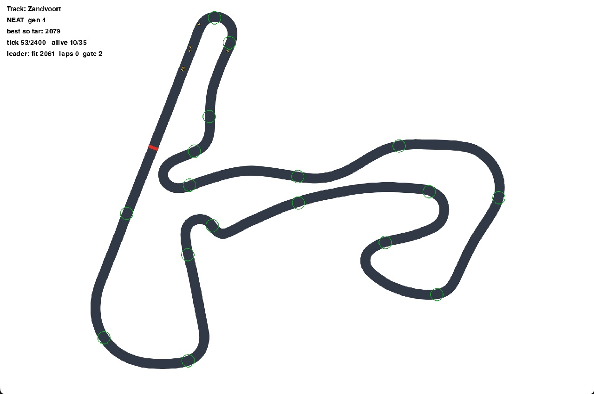
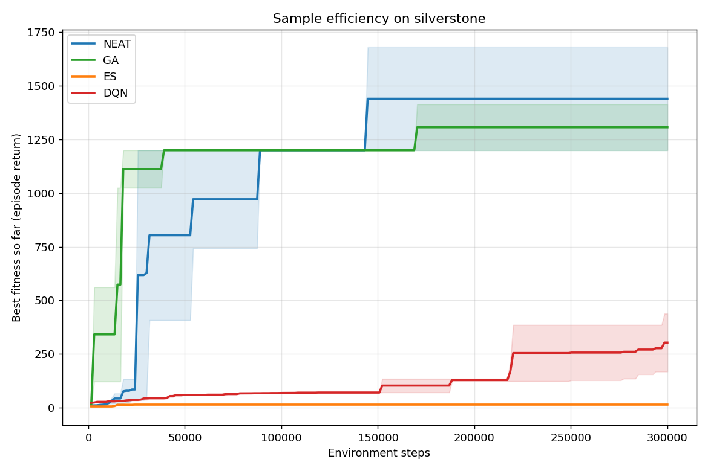
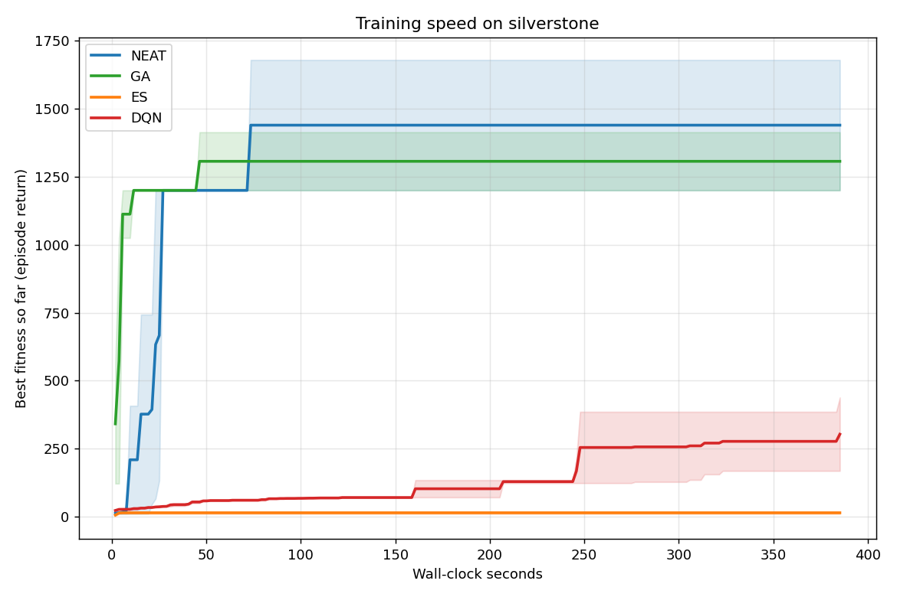
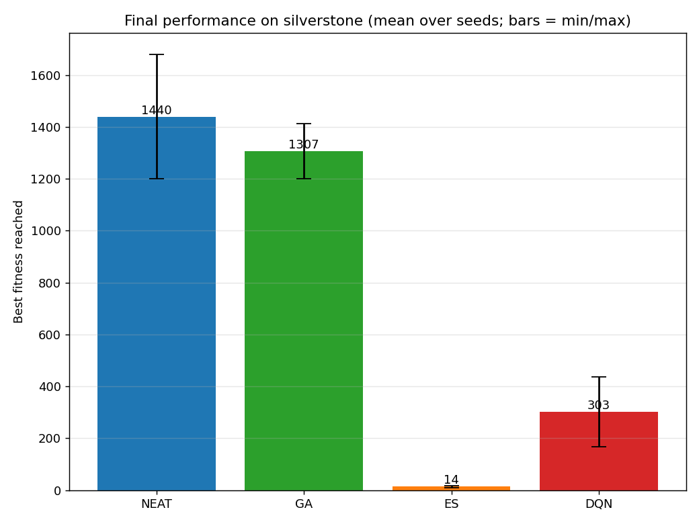

# Self-Driving Cars Around F1 Tracks Using AI

A self-driving AI car simulation using NeuroEvolution of Augmenting Topologies (NEAT) algorithm. 

<p align="center">
  
  
  
  
</p>

## Installation 

Use the package manager [pip3](https://pip.pypa.io/en/stable/) to install neat-python and pygame. 

```bash
pip3 install neat-python
pip3 install pygame
```

## Usage

Train drivers on a track (opens a fullscreen window):

```bash
python3 play.py silverstone
```

### Faster training & watching the result

The simulation now saves the best evolved driver and lets you replay it:

```bash
python3 play.py silverstone --fast              # headless, no window — trains many generations per second
python3 play.py silverstone --generations 200   # cap how long training runs
python3 play.py silverstone --replay            # load champions/silverstone.pkl and watch it drive
```

Training periodically writes NEAT checkpoints and, when it finishes, pickles the
best genome to `champions/<track>.pkl`.

### Lap-aware reward (checkpoint gates)

By default fitness rewards distance driven. For real racing behaviour you can
place ordered **checkpoint gates** around a track; the car is then rewarded for
passing them in sequence and completing laps. Author them interactively:

```bash
python3 play.py silverstone --edit-checkpoints
```

In the editor: **click** to drop a gate, **`-` / `+`** (or **down** / **up**) to
shrink/grow its radius, **`u`** to undo, **`s`** to save to
`checkpoints/<track>.json`, **esc** to quit. The default radius (20) spans the
~33px road; a gate should cover the road curb-to-curb so a car passes it from any
line. If a gate file exists it is used automatically during training and replay;
otherwise training falls back to the distance reward.

### Sensors

Each car sees **7 radar beams** (−90° to +90°) plus its own normalized speed —
8 network inputs in total. The four outputs are steer-left, steer-right, brake,
and accelerate. `num_inputs` in `config.txt` must match (a startup check
enforces this).

You can change the configurations in config.txt to see if you can create better models!

## Comparing AI techniques (NEAT vs GA vs ES vs DQN)

NEAT is only one way to produce a driver. The simulation is really an
*environment* (car physics + 8 sensor inputs + 4 discrete actions + the same
gate/distance reward) with a *policy* (obs → action) bolted on top — and the
environment doesn't care how that policy is produced. `carenv.py` exposes that
environment as a tiny Gym-like `reset()` / `step(action)` wrapper around the
existing `Car`, and `techniques/` plugs four different learners into it:

| Technique | File | Paradigm |
|---|---|---|
| **NEAT** | `techniques/neat_runner.py` | Evolution that *grows* network topology (the incumbent) |
| **Fixed-topology GA** | `techniques/ga.py` | Evolution of weights in a *fixed* MLP |
| **Evolution Strategies** | `techniques/es.py` | OpenAI-ES: gradient estimate from random perturbations |
| **DQN** | `techniques/dqn.py` | Gradient-based reinforcement learning (PyTorch) |

GA and ES share the same fixed MLP (`techniques/mlp.py`), so comparing them to
NEAT isolates the question *"does growing topology actually help here?"*

### Running the benchmark

```bash
pip3 install numpy matplotlib torch          # extra deps for the benchmark
python3 benchmark.py silverstone             # all four, 300k env-steps each
python3 benchmark.py monza --steps 400000 --seeds 3
python3 benchmark.py spa --algos NEAT GA --quick   # fast smoke test (20k steps)
```

Every technique gets the **same budget of environment steps** — the fair
cross-paradigm unit of work, since a NEAT/GA "generation" and a DQN "episode"
cost very different numbers of steps. Results land in `results/<track>/`:

- `metrics.csv` — raw per-generation/episode log
- `fitness_vs_steps.png` — sample efficiency (the headline chart)
- `fitness_vs_walltime.png` — practical training speed
- `final_performance.png` — best fitness reached per technique (mean ± min/max over seeds)

> Note: without authored checkpoint gates the reward is distance-based, which is
> identical across all four techniques, so the comparison stays fair. Author
> gates (see above) for a lap-aware benchmark.

### Benchmark results

A reference run on **Silverstone** — 300k env-steps per technique, one seed,
distance reward — gives a sense of how the paradigms stack up on this task:

| Technique | Best fitness | Iterations at budget | Wall time |
|---|---:|---:|---:|
| **NEAT** (growing topology) | **1679.7** | 141 generations | ~123 s |
| **GA** (fixed MLP) | 1413.8 | 72 generations | ~106 s |
| **DQN** (gradient RL) | 438.0 | 23,227 episodes | ~385 s |
| **ES** (fixed MLP) | 18.5 | 1,409 generations | ~78 s |

**Takeaway:** at this budget the evolutionary searches lead, and NEAT's
*growing* topology edges out the fixed-MLP GA — so on this environment, growing
structure does help. DQN is still climbing (and is slowest in wall-clock), while
OpenAI-ES is the least sample-efficient here: its single global perturbation step
barely moves off the start. No technique completed a full lap in 300k steps under
the distance reward — author gates for a lap-aware comparison.

The charts below are written to `results/<track>/` by every run (`results/` is
git-ignored, so these are committed copies):

<p align="center">
  
  
  
</p>

### Watching any technique drive (`watch.py`)

`benchmark.py` is headless (it only writes charts). To actually *see* a technique
on the track — and pick which one — use `watch.py`, the visual counterpart:

```bash
python3 watch.py silverstone --algo ga          # watch GA train, live in a window
python3 watch.py silverstone --algo neat         # any of: neat, ga, es, dqn
python3 watch.py silverstone --algo dqn --steps 120000
python3 watch.py silverstone --algo es --replay  # load the saved champion and just watch it drive
```

What you see while **training** depends on the paradigm:

- **NEAT / GA / ES** are population methods, so the *whole generation* drives the
  track simultaneously — you watch the swarm improve generation by generation.
- **DQN** is a single agent, so you watch that one car drive episode after episode
  as it learns.

Each new best policy is saved to `champions/<track>-<algo>.*`, so `--replay` can
reload it later. `benchmark.py` writes the **same** champion files, so you can
benchmark headlessly and then replay any technique's winner with
`python3 watch.py <track> --algo <x> --replay`.

Keys while watching: **SPACE** pause/resume · **F** toggle fast (uncapped, skips
drawing) · **ESC** or closing the window quits. Useful flags: `--gens N`
(NEAT/GA/ES length), `--steps N` (DQN length), `--episodes N` (replay count),
`--max-ticks N` (ticks before a reset), `--fps N`, `--scale PX` (window width).

## Command-line options

Every command takes a required `track` argument (one of the 8 below). The full
option set for each entry point:

### `play.py` — original NEAT trainer

| Option | Default | Description |
|---|---|---|
| `track` | *(required)* | track to drive |
| `--fast` | off | headless, uncapped frame rate (fast training, no window) |
| `--generations N` | 1000 | max generations to train |
| `--replay` | off | load the saved champion (`champions/<track>.pkl`) and drive it |
| `--edit-checkpoints` | off | open the interactive gate editor for this track |

### `benchmark.py` — headless NEAT vs GA vs ES vs DQN

| Option | Default | Description |
|---|---|---|
| `track` | *(required)* | track to benchmark on |
| `--algos NEAT GA ES DQN` | all four | techniques to run (space-separated subset) |
| `--steps N` | 300000 | env-step budget per technique per seed |
| `--seeds N` | 1 | independent runs per technique |
| `--quick` | off | tiny-budget smoke test (20k steps) |
| `--out DIR` | `results` | output directory root |

### `watch.py` — visual trainer / champion replay

| Option | Default | Description |
|---|---|---|
| `track` | *(required)* | track to drive |
| `--algo {neat,ga,es,dqn}` | *(required)* | which technique to watch |
| `--replay` | off | load the saved champion for this (track, algo) and just watch it drive |
| `--episodes N` | 0 | replay episodes before exiting (0 = loop until you close the window) |
| `--gens N` | 30 | generations to train (NEAT/GA/ES) |
| `--steps N` | 80000 | env-step budget to train (DQN) |
| `--max-ticks N` | 2400 | max ticks per generation/episode before reset |
| `--fps N` | 60 | frame-rate cap (press **F** to uncap) |
| `--scale PX` | 1280 | max window width in pixels |
| `--seed N` | 0 | RNG seed |

In-window keys (`watch.py`): **SPACE** pause/resume · **F** toggle fast
(uncapped, skips drawing) · **ESC** / close window to quit.

There are 8 F1 tracks:

1. Bahrain
2. Interlagos
3. Shanghai
4. Monza
5. Zandvoort
6. Spa
7. COTA
8. Silverstone

The tracks have been modified from the svgs from https://f1laps.gumroad.com/l/f1-track-vectors, and the project has been inspired by https://youtu.be/2o-jMhXmmxA?si=XuOJL1j5XHNsid49.

